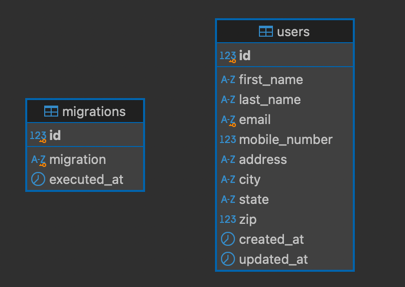

# Software Design Document (SDD)

## 1. Introduction

### 1.1 Purpose

The purpose of this Software Design Document (SDD) is to provide a detailed architecture and design plan for the User
Management System, ensuring scalability, and alignment with project requirements.

### 1.2 Scope

- Provides CRUD (Create, Read, Update, Delete) functionality for managing user data.
- Use a responsive user interface
- Implement validation on both client-side (JavaScript) and server-side (PHP).
- Support AJAX-based operations.

## 2. System Overview

User Management System is composed of a PHP backend for data handling, a JavaScript frontend for data visualization, and
MySQL as the database.

## 3. Architectural Design

### 3.1 Layered Architecture

#### 1. Presentation Layer (Frontend):

- HTML, Bootstrap, and JavaScript.
- AJAX handles create, update, and delete operations.

#### 2. Application Layer (Classes):

- Handles requests, validates input, and delegates tasks to services.

#### 3. Service Layer:

- Contains business logic and communicates between controllers and models.

#### 4. Data Layer (Models):

- Handles database interactions using PDO and MySQL.

#### 5. Database Layer:

- MySQL database for storing user information.

## 4. Database Design

## 5. Components

### 5.1 Frontend

- Technologies: HTML, Bootstrap, JavaScript (jQuery).

### 5.2 Backend

- Technologies: PHP.

### 5.3 Database

#### Schema:

- Table: users.
    - Columns: id, first_name, last_name, email, mobile_number, address, city, state, zip, created_at, updated_at.
- Seeders:
    - Generates sample data using Faker for testing.
- Migrations:
    - Handles schema creation and updates.

### 5.4 Testing

- PHP:
    - PHPUnit tests for CRUD operations and validation.
- JavaScript:
    - Jest tests for AJAX calls.

## 6. Key Design Considerations

### 6.1 Scalability

- Design allows easy addition of new features.
- Service layer promotes separation of concerns.

### 6.2 Maintainability

- Clear separation between controllers, services, and models.
- Use of dependency injection for flexibility.

### 6.3 Usability

- Responsive design ensures compatibility with multiple devices.
- AJAX improves user experience with minimal page reloads.

## 7. Future Enhancements

  1. Add user authentication and roles.
  2. Implement sorting and filtering on the user list table.
  3. Enhance testing coverage.
  4. Add better error messages.